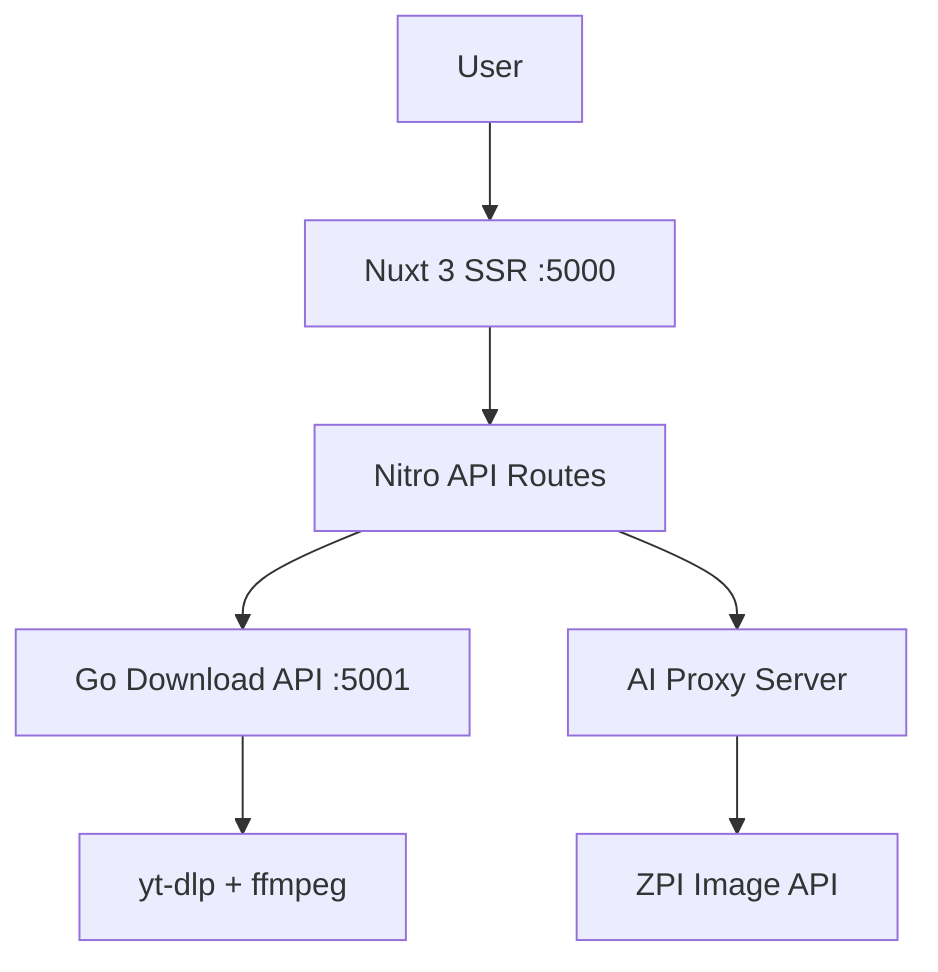

# FiGo — All-in-One Media & Tools Platform

Platform berbasis **Nuxt 3 SSR** yang menggabungkan berbagai tools produktivitas: streaming video, AI image processing, analisis forex, dan manajemen dataset konten Nusantara.

## Tech Stack

- **Frontend**: Nuxt 3 (SSR), Vue 3, TailwindCSS
- **Backend API**: Go (port 5001) — download engine dengan yt-dlp & ffmpeg
- **AI Tools**: Remove BG, Image Upscale, Enhance, Denoise via proxy
- **Auth**: PIN-based stream unlock dengan HMAC token signing

## Fitur Utama

| Modul | Deskripsi |
|---|---|
| 🎬 Stream Player | HLS native player, strict title search, PIN-protected |
| 📥 Downloader | YouTube/media download via Go API + yt-dlp |
| 🤖 AI Studio | Image processing: remove-bg, upscale, enhance, denoise |
| 📈 Forex Signals | Multi-indikator: SMA, EMA, RSI, MACD, BB, ATR, Fibonacci |
| 📚 Artikel | Dataset konten Nusantara (Wedhatama, Suluk Dewa Ruci, dll) |

## Setup

```bash
# Install dependencies
pnpm install

# Development server (port 5000)
pnpm dev

# Production build
pnpm build
```

## Environment Variables

```env
NUXT_STREAM_PIN=112233
NUXT_STREAM_SECRET=your-secret-here
```

## Architecture



## PM2 Process

- **ID 4** — Web (Nuxt SSR)
- **ID 5** — DL API (Go backend)
