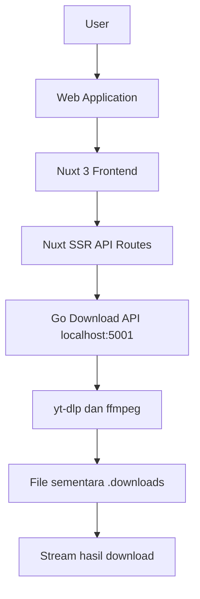

# Documentation

## Entity Rules

| Entity | Rule | Notes |
|---|---|---|
| AI Trading Plan | Kalkulasi mult-indikator | Menggunakan SMA, EMA, RSI, MACD, BB, Vol, ATR, Fib |
| Analisa KG | Deteksi Flat & Trending | Menggunakan BB SD 1 sebagai batas Normal/Ubnormal |
| File Metadata | Ekstraksi 100% Client-side | Hash via WebCrypto, Parsing EXIF via exifreader |
| Secure Generator | Data Creation 100% Client-side | Passwords, Passphrases (EFF list), Hashes via WebCrypto |
| File Processing (Compress/Convert) | Magic Bytes Validation | Setiap file divalidasi struktur hex stream-nya (mencegah polyglot files dan eksekusi malware yang dikamuflase). Max 50MB per file, 10 file per batch, Rate limit: 30req/min |
| Nutrition Index | Proxy HuggingFace API | Menampilkan data nutrisi global dari OpenFoodFacts via HuggingFace datasets-server. Mendukung pencarian, filter negara, dan pagination. |
| Media Proxy | Penanganan CORS & Signature Kedaluwarsa | Menghindari CORS Hotlinking Block dengan fetch server-side. Jika CDN signature kedaluwarsa atau diblokir (403/404), sistem secara otomatis mengembalikan SVG Fallback untuk thumbnail inline dan mencatat peringatan (warning log) biasa tanpa melemparkan error fatal. |
| Download Media | Job Background via Go API | Mode info tetap diproses Nuxt. Mode download diproxy ke service Go lokal port 5001 untuk menjalankan yt-dlp/ffmpeg dengan concurrency rendah. File temporer disimpan di `.downloads` dan dihapus setelah diunduh atau saat TTL kedaluwarsa. |
| Support System | Pengalihan Platform & QR Code | Menyediakan antarmuka modern (tab) untuk donasi ke platform Trakteer (lokal) dan Ko-fi (global). QR Code digenerate secara dinamis dan real-time menggunakan endpoint server-side /api/tools/qr. Menyertakan tautan portofolio kreator (https://fikfikk.my.id/) di bagian bawah modal dan footer. |
| SEO System | SSR + Structured Data + Sitemap | SSR diaktifkan (ssr: true). Setiap halaman memiliki useSeoMeta() lengkap (title, description, ogTitle, ogDescription, twitterCard). JSON-LD schema (WebSite, WebApplication, FAQPage) di halaman utama dan tools. Sitemap statis di /public/sitemap.xml. robots.txt dengan Sitemap reference. FAQ sections semantic (details/summary) di halaman download, compress, dan convert untuk crawler content. |

## Status Transitions

| Entitas | Dari | Ke | Pemicu | Catatan |
|---|---|---|---|---|
| Download Job | Baru | processing | User memilih format dan mulai download | Nuxt membuat request ke Go Download API. |
| Download Job | processing | done | yt-dlp/ffmpeg selesai dan file ditemukan | File siap diambil lewat `/api/download-file?id=...`. |
| Download Job | processing | error | yt-dlp/ffmpeg timeout, gagal, atau file tidak ditemukan | Error dikembalikan ke polling frontend. |
| Download Job | done | dihapus | File selesai di-stream ke user atau TTL 15 menit habis | File temporer ikut dihapus. |
| Download Job | error | dihapus | TTL 5 menit habis | Entry job dibersihkan otomatis. |

## SEO Configuration

| Komponen | File | Keterangan |
|---|---|---|
| SSR | `nuxt.config.ts` | `ssr: true` — wajib agar meta tags ter-render di HTML source |
| Global Meta | `nuxt.config.ts` | robots, googlebot, keywords, OG tags, Twitter Card |
| Title Template | `app/app.vue` | Dynamic title suffix via `titleTemplate` |
| JSON-LD WebSite | `app/app.vue` | Schema.org WebSite + SearchAction untuk sitelinks |
| JSON-LD WebApp | `app/pages/index.vue` | Schema.org WebApplication untuk rich results |
| JSON-LD FAQ | `app/pages/download.vue`, `compress.vue`, `convert.vue` | FAQPage schema untuk featured snippets |
| Sitemap | `public/sitemap.xml` | Semua halaman publik dengan priority dan changefreq |
| Robots | `public/robots.txt` | Allow all, Disallow /api/, Sitemap reference |
| Per-Page SEO | Semua `pages/*.vue` | useSeoMeta() dengan keyword-rich title & description |
| Dynamic SEO | `pages/tools/[slug].vue` | SEO meta berubah berdasarkan slug aktif |
