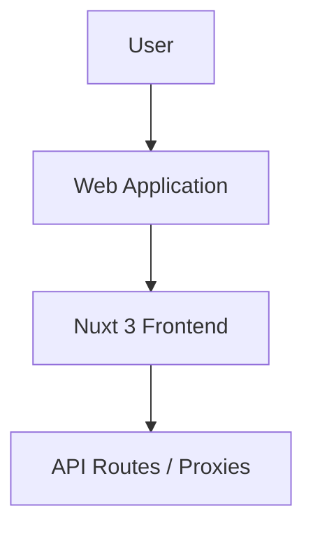

# Documentation

## Entity Rules

| Entity | Rule | Notes |
|---|---|---|
| AI Trading Plan | Kalkulasi mult-indikator | Menggunakan SMA, EMA, RSI, MACD, BB, Vol, ATR, Fib |
| Analisa KG | Deteksi Flat & Trending | Menggunakan BB SD 1 sebagai batas Normal/Ubnormal |
| File Metadata | Ekstraksi 100% Client-side | Hash via WebCrypto, Parsing EXIF via exifreader |

## Status Transitions
*N/A*
