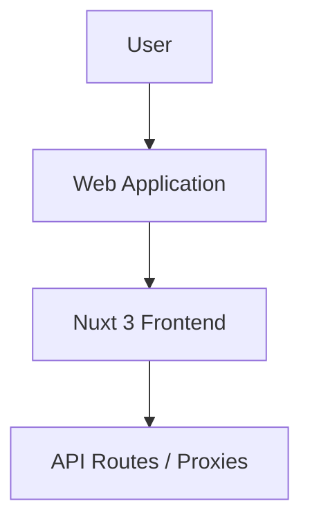

# Documentation

## Entity Rules

| Entity | Rule | Notes |
|---|---|---|
| AI Trading Plan | Kalkulasi mult-indikator | Menggunakan SMA, EMA, RSI, MACD, BB, Vol, ATR, Fib |
| Analisa KG | Deteksi Flat & Trending | Menggunakan BB SD 1 sebagai batas Normal/Ubnormal |
| File Metadata | Ekstraksi 100% Client-side | Hash via WebCrypto, Parsing EXIF via exifreader |
| Secure Generator | Data Creation 100% Client-side | Passwords, Passphrases (EFF list), Hashes via WebCrypto |
| File Processing (Compress/Convert) | Magic Bytes Validation | Setiap file divalidasi struktur hex stream-nya (mencegah polyglot files dan eksekusi malware yang dikamuflase). Max 50MB per file, 10 file per batch, Rate limit: 30req/min |
| Nutrition Index | Proxy HuggingFace API | Menampilkan data nutrisi global dari OpenFoodFacts via HuggingFace datasets-server. Mendukung pencarian, filter negara, dan pagination. |

## Status Transitions
*N/A*
