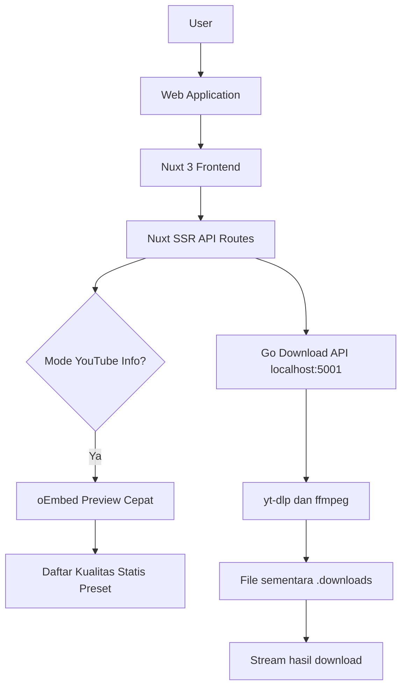
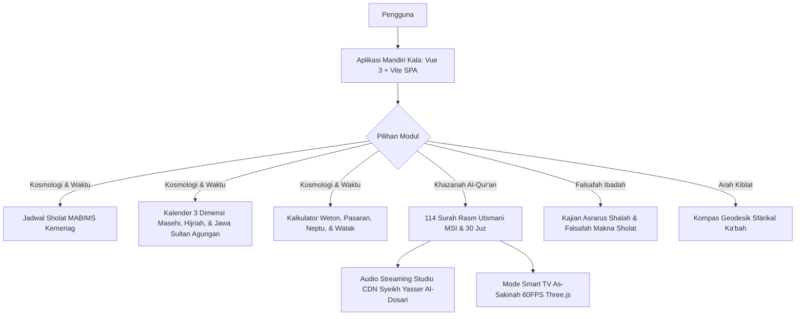

# Documentation

```mermaid
graph TD
    A[User] --> B[Web Application]
    B --> C[Nuxt 3 Frontend]
    C --> D[Nuxt SSR API Routes]
    D --> E{Mode YouTube Info?}
    E -->|Ya| F[oEmbed Preview Cepat]
    F --> G[Daftar Kualitas Statis Preset]
    D --> I[Go Download API localhost:5001]
    I --> J[yt-dlp dan ffmpeg]
    J --> K[File sementara .downloads]
    K --> L[Stream hasil download]
```

## Entity Rules

| Entity                             | Rule                                    | Notes                                                                                                                                                                                                                                                                                                                                                                   |
| ---------------------------------- | --------------------------------------- | ------------------------------------------------------------------------------------------------------------------------------------------------------------------------------------------------------------------------------------------------------------------------------------------------------------------------------------------------------------------------------------------------------- |
| Interactive Candlestick Chart      | Fullscreen Immersive & Body Teleport    | Menggunakan `<Teleport to="body" :disabled="!isFullscreen">` dengan `z-[99999]` dan `p-0 m-0` agar chart menutupi viewport 100% tanpa celah atas. Menghindari stacking context trap dari navbar/layout (`relative z-10`), menyinkronkan event native `fullscreenchange`, menyesuaikan tinggi canvas secara fleksibel (`flex-1 min-h-0`), serta menyediakan rentang data historis Yahoo Finance hingga 2 tahun (`2y`) untuk kelancaran gestur drag & pan data masa lalu. |
| AI Trading Plan                    | Kalkulasi multi-indikator               | Menggunakan SMA, EMA, RSI, MACD, BB, Vol, ATR, Fib. Diintegrasikan di `/tradingplan` dengan tampilan institusional rounded-md.                                                                                                                                                                                                                                                                    |
| AI Fundamental Insights            | Proxy Audit Rasio & Ekstensibilitas LLM | Menampilkan skor audit finansial (Valuation, Health, Earnings, Performance). Endpoint `/api/stock/insights` memiliki fallback UI elegan jika sumber upstream mengalami 503/kosong, dan siap dihubungkan langsung ke Live AI Router eksternal/internal.                                                                                                                                               |
| Trading Terminal Vault             | Proteksi PIN Persisten (useCookie 7hr)  | Halaman `/tradingplan` diproteksi PIN (`112233`) dengan sesi cookie 7 hari (`figo_stock_pin`), sehingga status unlock tetap tersimpan setelah refresh (F5). Menyimpan cache recent ticker di `localStorage` (`figo_recent_tickers`) dan mendukung penambahan ticker kustom langsung via tombol `+ Quick`.                                                           |
| Edukasi Saham (Public Academy)     | Bebas Akses Tanpa Autentikasi           | Halaman `/stocks` difokuskan 100% sebagai pusat edukasi, ensiklopedia pola chart institusional, metodologi trading, dan kalender ekonomi publik tanpa live API switcher atau prompt PIN. Modal pola dan konsep dilengkapi Playbook Master Trader serta simulasi chart studi kasus nyata (textbook case) dengan lilin besar dan proporsional (bodi tebal 18px, spacing 28px, 6–9 lilin kontekstual), memetakan tren sebelum pola, formasi anatomi presisi di Key Support/Resistance, konfirmasi breakout/breakdown dengan Volume Spike VSA, dan penempatan label bebas tabrakan. |
| Analisa KG                         | Deteksi Flat & Trending                 | Menggunakan BB SD 1 sebagai batas Normal/Ubnormal                                                                                                                                                                                                                           |
| File Metadata                      | Ekstraksi 100% Client-side              | Hash via WebCrypto, Parsing EXIF via exifreader                                                                                                                                                                                                                                                                                                                                                         |
| Secure Generator                   | Data Creation 100% Client-side          | Passwords, Passphrases (EFF list), Hashes via WebCrypto                                                                                                                                                                                                                                                                                                                                                 |
| File Processing (Compress/Convert) | Magic Bytes Validation                  | Setiap file divalidasi struktur hex stream-nya (mencegah polyglot files dan eksekusi malware yang dikamuflase). Max 50MB per file, 10 file per batch, Rate limit: 30req/min                                                                                                                                                                                                                             |
| Nutrition Index                    | Proxy HuggingFace API                   | Menampilkan data nutrisi global dari OpenFoodFacts via HuggingFace datasets-server. Mendukung pencarian, filter negara, dan pagination.                                                                                                                                                                                                                                                                 |
| Media Proxy                        | Penanganan CORS & Signature Kedaluwarsa | Menghindari CORS Hotlinking Block dengan fetch server-side. Jika CDN signature kedaluwarsa atau diblokir (403/404), sistem secara otomatis mengembalikan SVG Fallback untuk thumbnail inline dan mencatat peringatan (warning log) biasa tanpa melemparkan error fatal.                                                                                                                                 |
| Download Media                     | Job Background via Go API               | Mode info YouTube mengembalikan preview cepat lewat oEmbed beserta daftar kualitas statis (preset 1080/720/480/360/Audio) tanpa menjalankan yt-dlp. Mode download diproxy ke service Go lokal port 5001 untuk menjalankan yt-dlp/ffmpeg dengan concurrency rendah. File temporer disimpan di `.downloads` dan dihapus setelah diunduh atau saat TTL kedaluwarsa.                                        |
| Support System                     | Pengalihan Platform & QR Code           | Menyediakan antarmuka modern (tab) untuk donasi ke platform Trakteer (lokal) dan Ko-fi (global). QR Code digenerate secara dinamis dan real-time menggunakan endpoint server-side /api/tools/qr. Menyertakan tautan portofolio kreator (https://fikfikk.my.id/) dan identitas lokasi (Surabaya, ID) di bagian bawah modal dan footer dengan styling rounded-2xl.                                                                                                       |
| Link Safety (Pemeriksa Tautan)     | Proteksi SSRF & Validasi Host           | Memblokir secara otomatis URL lokal, loopback (127.0.0.1, localhost), IP privat (RFC1918), dan metadata cloud (169.254.169.254) untuk mencegah pemindaian jaringan internal. Menganalisis DNSBL, SSL, dan phishing pattern.                                                                                                                                                                          |
| Performa & Keamanan Web            | Route Rules & Header Keamanan Global    | Header keamanan wajib (nosniff, SAMEORIGIN, Referrer-Policy) terpasang di seluruh rute. Prerender aktif untuk rute statis, SWR/ISR untuk modul data, View Transition native untuk routing secepat kilat, dan kompresi aset Brotli/Gzip di Nitro.                                                                                                                                                       |
| Desain & Tema Obsidian             | Optimasi Render & Safe-Area Mobile      | Dark mode menggunakan palet Obsidian pekat `#08090d` dengan ambient glow via CSS radial-gradient statis pada body (mencegah beban GPU composition dari layer blur DOM). Navigasi mobile edge-to-edge menggunakan `safe-area-inset-bottom` dan backdrop blur ringan (`backdrop-blur-md`) untuk menjamin performa 60 FPS dan mencegah overlap konten. |
| Pengetahuan Nusantara Reader (Mobile Sheet & Layout Imersif) | Teleport Body, Layering z-[80], & Isolasi Header Mode Baca | Header katalog global disembunyikan secara kondisional (`v-if="!selectedDoc"`) saat mode baca aktif guna mengeliminasi penumpukan 3 lapis judul di mobile dan memberikan ruang baca instan (*above the fold*). Dilengkapi top bar baca ringkas, modal bottom sheet dengan `<Teleport to="body">` dan layering `z-[80]` (di atas `AppNavbar` `z-[60]`), scroll independen (`overscroll-contain`), penguncian scroll background (`overflow: hidden` pada `body`), safe-area padding (`pb-[calc(2.5rem+env(safe-area-inset-bottom))]`), segmented tab switcher antara Daftar Isi dan Sorotan Tersimpan, serta pratinjau langsung tipografi pada preferensi Tampilan Baca. |
| Tipografi Pembaca & Parser List Markdown | Line Breaking Butir Nomor, Callout Kaligrafi, Lencana Tautan Eksternal, & Isolasi Blok Teks | Parser `renderParagraph` memisahkan setiap butir bernomor (`1.`, `2.`, dst.) dan butir bertanda bintang (`*`) ke baris baru independen dengan badge melingkar emerald (`w-full flex items-start gap-3 my-2.5`). Mendukung indentasi Markdown dan butir nomor yang tersambung dalam kalimat. Tautan rujukan Markdown (`[label](url)`) otomatis dikonversi menjadi lencana ringkas interaktif dengan ikon tautan eksternal (`↗`) tanpa menampilkan URL mentah panjang, lengkap dengan sanitasi protokol dan decoding entitas URL. Seluruh baris teks non-blok dibungkus dalam `
` untuk mencegah peleburan baris di browser, serta dilengkapi kartu kaligrafi aksara Arab berfitur RTL otomatis (`dir="rtl"`) dan bypass cache dataset (`?v=timestamp`). |
| Al-Qur'an Al-Karim Digital (Kemenag RI & Audio Syeikh Yasser Al-Dosari) | Rasm Utsmani MSI, Terjemahan Resmi Kemenag, Audio Studio Full Yasser Al-Dosari, Docked Header Replacement, Mode Smart TV Ambient Display (3D Three.js As-Sakinah Silk Wave Mesh, Jam Persisten, Aliran Lirik 3-Ayat Spotify-Style 60FPS GPU Transform Tanpa Card, Piringan Kaligrafi Statis, & Tipografi Adaptif Ayat Panjang), Kalibrasi Akustik Timestamps, Jeda Antisipasi Lirik (0.5s Lead Time), & Isolasi Pemutaran Audio Surah | Menyediakan 114 Surah dan 30 Juz Al-Qur'an lengkap berbasis Rasm Utsmani Mushaf Standar Indonesia (MSI) dan terjemahan resmi Kemenag RI. Dilengkapi ornamen medali geometris islami berangka Arab Timur di setiap akhir ayat serta mode baca ganda (Ayat demi Ayat & Mushaf Membaca). Navigasi mengusung arsitektur *Docked Header Replacement*: FiGo navbar meluncur naik-turun secara headroom saat scroll, sementara Quran Header meluncur mulus menggantikan posisi FiGo navbar di `top-0` dan tetap tersemat (docked) agar kendali baca selalu siap diakses tanpa menutupi teks ayat (`pt-32`). Mengusung pemutar audio pintar dengan pemisahan mode: (1) **Mode Lanjut Surah**: Memutar berkas audio rekaman studio penuh 1 surah utuh (`/audio/quran/06/full/`) dipadu pemetaan timestamp presisi akustik milidetik (`yasser_timestamps.json`) yang telah dikalibrasi terhadap offset lantunan basmalah/intro studio (misal: 3.39s pada Surah 23 Al-Mu'minun). Dilengkapi **Jeda Antisipasi Lirik** (`LYRIC_LEAD_TIME = 0.5` detik) yang memajukan perpindahan tampilan teks ayat berikutnya tepat saat pelafalan ayat sebelumnya usai dan qari sedang mengambil jeda napas (waqaf), memberi waktu baca yang rileks bagi pembaca agar ritme membaca tetap selaras dengan lantunan audio; (2) **Mode Per Ayat**: Memutar hanya 1 ayat terpilih (`/audio/quran/06/{surah}{ayat}.mp3`) lalu berhenti otomatis (ideal untuk hafalan/tahfidz). Dilengkapi **Mode Smart TV Ambient Quran Player** (`QuranTvMode.vue` didukung `QuranTvCelestialScene.vue`) berskala sinematik 16:9 dengan latar belakang angkasa 3D Three.js "As-Sakinah" (gelombang sutra hening/undulating wave mesh hijau zamrud `#064e3b` dan aksen emas `#f59e0b` yang lembut dan meditatif tanpa partikel debu bising), piringan hitam islami dengan pemisahan rotasi cincin dan kubah kaligrafi tengah tetap tegak statis tanpa berputar, sistem lirik vertikal mengalir tanpa boks kartu (Spotify-style stream: ayat sebelumnya dimmed `opacity-30`, ayat aktif fokus 100% dengan aksen zamrud emas, ayat berikutnya dimmed `opacity-35`) dengan akselerasi perangkat keras GPU Compositor 60FPS (`transform: translate3d(0, Y, 0)` dan `will-change: transform` tanpa pemicu reflow layout), penyesuaian tipografi adaptif untuk ayat panjang agar teks tidak terpotong dan tetap terbaca utuh, jam dinding digital real-time persisten, live frequency equalizer bar, sanitasi karakter kontrol fonetik latin (`cleanLatinText`), dan shortcut remote TV (Spasi/Panah/F). Seluruh pemutaran audio surah diproteksi mekanisme *Strict Surah Binding* (`currentFullSurahNumber`, event reload metadata, dan penolak residual timeupdate) sehingga pergantian ke surah mana pun dijamin memutar berkas surah yang tepat dan tidak pernah tertukar atau memutar audio surah sebelumnya. Jika offline atau API streaming online qari lain bermasalah, sistem secara anggun (*graceful fallback*) mengalihkan ke audio lokal Syeikh Yasser Al-Dosari. |
| Pengetahuan Nusantara Catalogue (Filter Terpadu & Compact) | Single Header, Chips Kategori Horizontal, & Akses Kartu Instan | Mengeliminasi pembungkus kotak sekunder, tombol beranda canggung di mobile, dan teks pengantar duplikat ("Telusuri koleksi"). Filter pencarian menyatu langsung dengan header, kategori menggunakan chip scroll horizontal 1 baris yang terisolasi presisi dalam grid (`w-full overflow-x-auto`), serta selektor urutkan dan counter artikel yang terintegrasi rapi pada satu baris ringkas. Menjamin margin kiri dan kanan simetris 100% pada semua viewport (16px pada mobile, 24px pada tablet, 32px pada desktop) selaras dengan AppNavbar dan bebas horizontal scroll. Kartu artikel dirancang dengan pembatas kolom grid eksplisit (`grid-cols-1 w-full min-w-0`), latar kontras `#10131c` dengan border tegas `dark:border-slate-800/90` serta padding standar penuh `p-5 sm:p-6` (20px pada mobile, 24px pada desktop) agar konten tidak menempel ke border dan memiliki ruang bernapas yang proporsional, eliminasi label duplikat 'Lanjut baca' (digantikan label progres terpadu dan bar emerald), status bookmark beraksen amber, serta pagination yang responsif. |
| Arsip Pengetahuan Hakikat Shalat (Turots & Asrarus Shalah) | Kurasi Otoritatif Fiqih, Hakikat, & Sejarah Mi'raj | Menyajikan rekonstruksi historis pewahyuan shalat di Sidratul Muntaha ('Am al-Huzn, diplomasi 50 ke 5 waktu), makna esensial ibadah sebagai Mi'raj spiritual orang beriman (*Ash-Shalatu Mi'rajul Mu'min*), bedah harfiah per lafadz dan makna batin dari Takbiratul Ihram hingga Salam berdasarkan rujukan *Ihya' 'Ulumuddin* (Al-Ghazali), *Asrarus Shalah* (Ibnul Qayyim), *Al-Majmu'* (An-Nawawi), dan hadits shahih. Meluruskan ragam pendapat furu'iyah (doa iftitah, tasyahhud) secara proporsional berbasis dalil mu'tabar. |
| GitHub Actions Multi-Target CI/CD  | Build Selektif via 3 Cabang Deteksi Paralel Independen (Backend, Frontend, Android) | Workflow `.github/workflows/build-all.yml` memecah deteksi berkas menjadi 3 cabang independen (`check-backend`, `check-frontend`, `check-android`) yang berjalan paralel dari awal tanpa single bottleneck. Setiap cabang mendeteksi jalurnya masing-masing (`backend-go/**` untuk Go, `app/**`/`server/**` untuk Nuxt, `android/**` untuk APK) dan langsung men-skip target yang tidak mengalami perubahan. Menghapus ketergantungan `android-actions/setup-android` yang deprecated dengan mengandalkan SDK bawaan runner GitHub (`$ANDROID_HOME`) dan Gradle JDK 21. Artefak dapat diunduh dari tab Actions dan otomatis dirilis saat tag `v*` dibuat. |
| Auto-Deploy Server Armbian         | Push Otomatis & Isolasi Rute Android    | Workflow `.github/workflows/deploy.yml` berjalan otomatis saat ada commit pada branch `main` melalui self-hosted runner di server Linux Armbian. Mengompilasi Nuxt SSR (`pnpm run build`) dan binary Go native (`go build`) langsung di arsitektur host ARM server, memublikasikan bundle via `rsync`, dan me-reload proses via PM2 (`startOrReload`). Direktori `android/**`, `capacitor.config.ts`, serta file dokumentasi diabaikan (`paths-ignore`) sehingga perubahan khusus APK Android tidak membebani server Armbian. |
| SEO System                         | SSR + Structured Data + Sitemap         | SSR diaktifkan (ssr: true). Setiap halaman memiliki useSeoMeta() lengkap (title, description, ogTitle, ogDescription, twitterCard). JSON-LD schema (WebSite, WebApplication, FAQPage) di halaman utama dan tools. Sitemap statis di /public/sitemap.xml. robots.txt dengan Sitemap reference. FAQ sections semantic (details/summary) di halaman download, compress, dan convert untuk crawler content. |

## Status Transitions

| Entitas      | Dari       | Ke         | Pemicu                                                  | Catatan                                              |
| ------------ | ---------- | ---------- | ------------------------------------------------------- | ---------------------------------------------------- |
| Download Job | Baru       | processing | User memilih format dan mulai download                  | Nuxt membuat request ke Go Download API.             |
| Download Job | processing | done       | yt-dlp/ffmpeg selesai dan file ditemukan                | File siap diambil lewat `/api/download-file?id=...`. |
| Download Job | processing | error      | yt-dlp/ffmpeg timeout, gagal, atau file tidak ditemukan | Error dikembalikan ke polling frontend.              |
| Download Job | done       | dihapus    | File selesai di-stream ke user atau TTL 15 menit habis  | File temporer ikut dihapus.                          |
| Download Job | error      | dihapus    | TTL 5 menit habis                                       | Entry job dibersihkan otomatis.                      |

## SEO Configuration

| Komponen        | File                                                    | Keterangan                                                   |
| --------------- | ------------------------------------------------------- | ------------------------------------------------------------ |
| SSR             | `nuxt.config.ts`                                        | `ssr: true` — wajib agar meta tags ter-render di HTML source |
| Global Meta     | `nuxt.config.ts`                                        | robots, googlebot, keywords, OG tags, Twitter Card           |
| Title Template  | `app/app.vue`                                           | Dynamic title suffix via `titleTemplate`                     |
| JSON-LD WebSite | `app/app.vue`                                           | Schema.org WebSite + SearchAction untuk sitelinks            |
| JSON-LD WebApp  | `app/pages/index.vue`                                   | Schema.org WebApplication untuk rich results                 |
| JSON-LD FAQ     | `app/pages/download.vue`, `compress.vue`, `convert.vue` | FAQPage schema untuk featured snippets                       |
| Sitemap         | `public/sitemap.xml`                                    | Semua halaman publik dengan priority dan changefreq (termasuk katalog `/tools`) |
| Robots          | `public/robots.txt`                                     | Allow all, Disallow /api/, Sitemap reference                 |
| Per-Page SEO    | Semua `pages/*.vue`                                     | useSeoMeta() dengan keyword-rich title & description         |
| Dynamic SEO     | `pages/tools/[slug].vue`                                | SEO meta berubah berdasarkan slug aktif                      |

## Arsitektur Aplikasi Kala (kala.fikfikk.my.id)

```mermaid
graph TD
    A[Pengguna] --> B[Aplikasi Mandiri Kala: Vue 3 + Vite SPA]
    B --> C{Pilihan Modul}
    C -->|Kosmologi & Waktu| D[Jadwal Sholat MABIMS Kemenag]
    C -->|Kosmologi & Waktu| E[Kalender 3 Dimensi Masehi, Hijriah, & Jawa Sultan Agungan]
    C -->|Kosmologi & Waktu| F[Kalkulator Weton, Pasaran, Neptu, & Watak]
    C -->|Khazanah Al-Qur'an| G[114 Surah Rasm Utsmani MSI & 30 Juz]
    G --> H[Audio Streaming Studio CDN Syeikh Yasser Al-Dosari]
    G --> I[Mode Smart TV As-Sakinah 60FPS Three.js]
    C -->|Falsafah Ibadah| J[Kajian Asrarus Shalah & Falsafah Makna Sholat]
    C -->|Arah Kiblat| K[Kompas Geodesik Sfärikal Ka'bah]
```

### Aturan Entitas Kala

| Entitas | Aturan Bisnis | Catatan |
| --- | --- | --- |
| Kala Standalone Architecture | Zero-Backend Static SPA Client-Side | Aplikasi dikompilasi menjadi static distribution murni (HTML/CSS/JS) tanpa membutuhkan server runtime Node.js atau PM2. Berjalan di port dev 9999, subdomain produksi `kala.fikfikk.my.id`, dan Android package `id.my.fikfikk.kala`. |
| Waktu Sholat & Adzan | Standar Kemenag RI / MABIMS & Geolocation Permissions | Sudut Subuh 20°, sudut Isya 18°, elevasi matahari Dhuha/Terbit, dan ihtiyat 2 menit. Menghitung mundur waktu sholat aktif dan berikutnya secara real-time via koordinat GPS perangkat. Dilengkapi penanganan izin lokasi peramban (Permission API), reverse geocoding nama kota/daerah, deteksi zona waktu dinamis (WIB/WITA/WIT), persistensi `localStorage`, serta modal pemilih kota dengan 42 kota utama di 38 provinsi Indonesia sebagai fallback. |
| Kalender Tiga Dimensi | Sinkronisasi Masehi, Hijriah, dan Jawa Sultan Agungan | Menghubungkan tanggal Gregorian dengan sistem Umm al-Qura dan penanggalan Jawa Sultan Agungan (Siklus Windu 8 tahun: Alip, Ehe, Jimawal, Je, Dal, Be, Wawu, Jimakhir; Kurup Asapon). |
| Kalkulator Weton & Karakter | Hari (7), Pasaran (5), Neptu (7–18), dan Watak Primbon | Menghitung neptu hari lahir dan neptu pasaran (Legi, Pahing, Pon, Wage, Kliwon) dengan titik acuan 1 Januari 1970 (Kamis Wage). Menyajikan watak kepribadian spiritual Jawa-Islam tanpa ramalan mistis destruktif. |
| Khazanah Al-Qur'an & Audio | Rasm Utsmani MSI & Streaming CDN Resmi | 114 Surah, 30 Juz, data MSI Kemenag RI. Audio rekaman studio Syeikh Yasser Al-Dosari di-stream langsung dari `cdn.equran.id` dengan penanda timestamp per ayat tanpa membebani memori lokal. |
| Mode Smart TV As-Sakinah | Layar Penuh 16:9 Ambient Display 60FPS | Gelombang sutra hening Three.js As-Sakinah emerald-gold, piringan kaligrafi statis, aliran lirik Spotify-style 3-baris vertikal akselerasi GPU compositor, jam digital real-time, dan remote control keyboard TV (Spasi/Panah/F/Esc). |
| Falsafah & Asrarus Shalah (Article Reader) | Arsitektur Reader 3-Kolom, Custom Tipografi, & Bottom Sheet Mobile | Menyajikan kajian Asrarus Shalah dalam layout artikel profesional ala FiGo: (1) Top bar progress persentase baca; (2) Kolom kiri `ReaderOutline` berisi daftar bab & sorotan bookmark tersimpan; (3) Kolom tengah artikel dengan kaligrafi Arab, kutipan suluk, dan navigasi bab; (4) Kolom kanan `ReaderSettings` untuk kustomisasi ukuran font (14-28px), pilihan jenis huruf (Serif/Sans), jarak baris (Rapat/Nyaman/Longgar), dan perataan paragraf (Rata Kiri/Justify); (5) Tombol aksi mengambang dan bottom sheet Teleport untuk pengalaman baca mobile. |
| Kompas Arah Kiblat | Perhitungan Great-Circle Azimuth Ka'bah | Menghitung arah sudut Ka'bah (21.4225° N, 39.8262° E) dari koordinat pengguna dengan toleransi keselarasan ±3°. Mendukung sensor orientasi magnetik perangkat HP dan slider simulasi desktop. |
| UI/UX Iconography & Navigation | 100% Vector SVG via Lucide (Zero Symbol Font) & Mobile Bottom Bar | Seluruh ikon aplikasi diubah menjadi ikon vektor SVG native Lucide (`lucide-vue-next`) untuk menjamin konsistensi render di semua peramban dan sistem operasi tanpa ketergantungan webfont glyph. Dilengkapi floating bottom navigation bar pada viewport mobile (`md:hidden`) dengan safe-area padding. |
| Auto-Scroll & Karaoke Aksara Arab | Smooth Viewport Centering & Pure Yellow Word-by-Word Highlight | (1) Layar otomatis memusatkan (smooth scroll center) ayat yang sedang diputar secara cerdas saat tilawah berpindah ayat atau saat tombol play ditekan, dilengkapi tombol toggle Auto-Scroll di header; (2) Efek karaoke aksara Arab murni berupa perubahan warna font menjadi kuning (`text-amber-400 font-bold`) tanpa border, tanpa box, tanpa ring, dan tanpa pill background. Kata aktif disorot kuning menyala, dan setelah selesai kata tersebut kembali ke putih lembut sehingga warna kuning tampak berjalan dinamis mengikuti nada pelafalan tilawah; (3) Dilengkapi kalibrasi akustik RMS energi suara per nada untuk Syeikh Yasser Al-Dosari dan model akustik Tajweed adaptif untuk qari lainnya. |
| Multi-Qari Engine | Dual-Mode Master Studio Lokal vs Qari Internasional Online | (1) **Lokal Studio (Gapless & Cepat)**: Syeikh Yasser Al-Dosari menggunakan audio continuous full stream dengan timestamp presisi milidetik; (2) **Qari Internasional (Streaming Online)**: Syeikh Misyari Rasyid Al-Afasy, Syeikh Abdurrahman As-Sudais, Syeikh Abdullah Al-Juhany, Syeikh Abdul Muhsin Al-Qasim, dan Syeikh Ibrahim Al-Dossari menggunakan dual-deck HTML5 audio player per ayat dengan pergantian instan tanpa jeda buffer; (3) Pilihan qari tersimpan otomatis di `localStorage` dan dapat diganti langsung dari header docked bar, drawer settings, maupun floating audio player bar. |

### Transisi Status Izin Lokasi & Geolocation

| Entitas | Dari | Ke | Pemicu | Catatan |
| --- | --- | --- | --- | --- |
| Izin Lokasi | Default / Prompt | Memindai (Locating) | Pengguna menekan tombol "Izinkan Akses Lokasi" atau "Gunakan GPS" | Browser menampilkan modal izin Geolocation API native. |
| Izin Lokasi | Memindai | Diberikan (Granted) | Pengguna menyetujui izin GPS pada dialog peramban | Koordinat lintang/bujur diperoleh, nama kota/daerah di-reverse geocode, zona waktu disesuaikan, dan jadwal adzan dihitung ulang. Disimpan ke `localStorage`. |
| Izin Lokasi | Memindai | Ditolak (Denied) | Pengguna menolak izin akses lokasi | Status berubah menjadi denied, peringatan ditampilkan ramah, dan pengguna diarahkan memilih kota manual tanpa merusak kalkulasi. |
| Izin Lokasi | Default / Denied | Manual Selected | Pengguna memilih kota dari modal CityPickerModal | Koordinat dan zona waktu kota terpilih diterapkan seketika dan disimpan ke `localStorage`. |

### Transisi Status Pemutaran Audio Kala

| Entitas | Dari | Ke | Pemicu | Catatan |
| --- | --- | --- | --- | --- |
| Audio Quran | Berhenti | Memutar | Pengguna menekan tombol putar ayat atau masuk Mode TV | Audio studio/online dimuat dari CDN, layar auto-scroll ke ayat, dan kata pertama disorot kuning menyala. |
| Audio Quran | Memutar | Berpindah Ayat | Timestamp ayat terlampaui (RAF ticker 60FPS) atau audio per-ayat berakhir | Layar otomatis memusatkan ayat baru, ayat sebelumnya kembali ke putih lembut, kata ayat baru mulai berjalan kuning. |
| Audio Quran | Memutar | Dijeda | Pengguna menekan tombol jeda atau Spasi di remote TV | Posisi detik pemutaran disimpan sementara, status highlight kata aktif terjaga. |
| Audio Quran | Memutar | Berganti Qari | Pengguna memilih qari lain dari menu dropdown atau drawer | Player menghentikan audio sebelumnya, beralih ke stream qari baru, dan melanjutkan pemutaran otomatis jika sedang aktif. |
| Audio Quran | Memutar | Selesai | Durasi surah berakhir pada ayat terakhir | Player berhenti dan status reset ke awal surah. |

